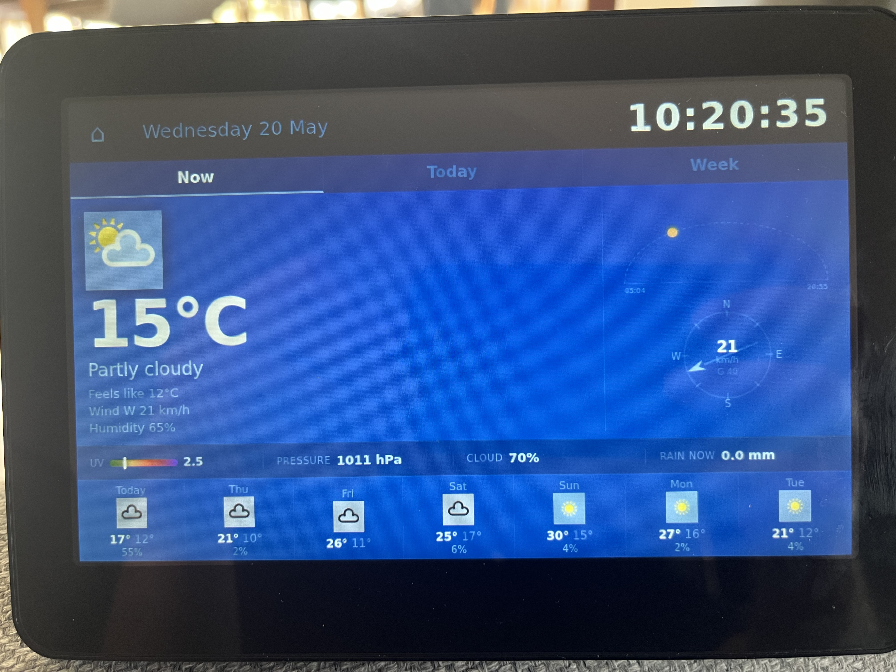
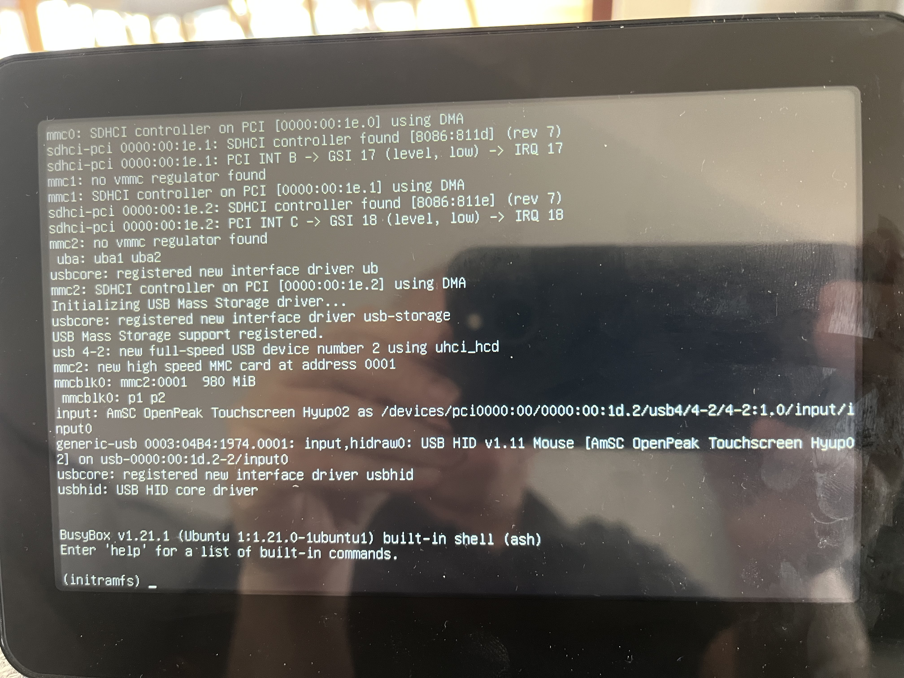
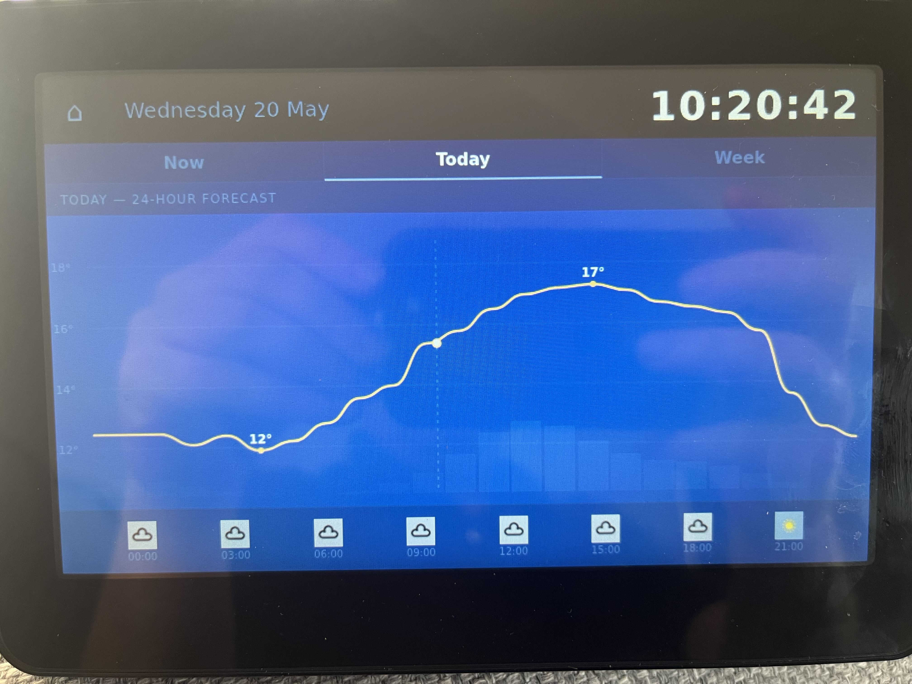
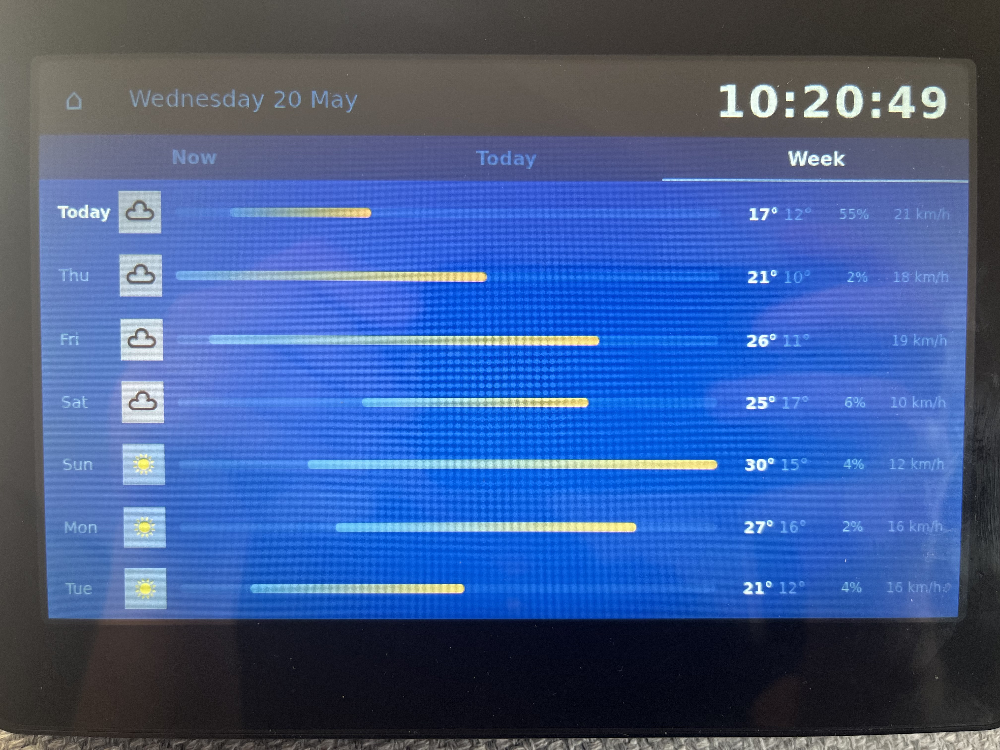

# Twyford Dashboard

A smart home kiosk built on an O2 Joggler — a repurposed 2010-era internet appliance with a
7" touchscreen. It runs as a full-screen dashboard for a house in Twyford, Berkshire, showing
live weather, radio, a wildlife camera, trains, flights radar, and a bus departure board.



---

## What is a Joggler?

The O2 Joggler (OpenPeak OpenFrame 1) was a UK consumer internet appliance from around 2010.
It has a 7" 800×480 resistive touchscreen, an Intel Atom Z520 CPU, 492 MB RAM, and originally
ran a bespoke Linux OS that is now defunct. This project replaces that OS with
[openframe-linux](https://github.com/birdslikewires/openframe-linux) (Debian Trixie) on a
USB stick, and repurposes the device as a persistent household display.

---

## Features

| Tile / View | What it shows |
|-------------|---------------|
| **Weather** | Current conditions, hourly chart, 7-day forecast. NOW / TODAY / WEEK tabs. Sun arc, wind compass, AQI, indoor temperatures from Hive heating. |
| **Radio** | 30+ stations — Marlow FM (with live SSE now-playing), Bauer/Global/indie streams. Station picker grid. Chromecast casting. |
| **WagtailCam** | Live MJPEG stream and dated timelapse from a garden wildlife camera. |
| **Trains** | Next 5 departures from Twyford station (National Rail live feed). Tap for calling points. |
| **Flights** | Leaflet.js radar map with ADS-B live positions, airline logos, and FlightAware route details. |
| **Buses** | Live departure board for Twyford stops (routes 850, 127, 128, 129, 12). Leaflet.js map with live vehicle positions. |

The dashboard is a single-file SPA (`dashboard.html`) — no framework, no build step.

### Responsive profiles

The dashboard automatically adapts to the display it runs on:

| Profile | Condition | Layout |
|---------|-----------|--------|
| `profile-joggler` | 800×≤490 px (Joggler exactly) | Original kiosk layout; power button visible |
| `profile-phone-portrait` | ≤540 px wide, portrait | 2-column tile grid; views scroll |
| `profile-phone-landscape` | ≤900 px wide, ≤500 px tall | 3-column compact tiles |
| `profile-card` | Everything else | 800 px centred card; power button hidden |

---

## Architecture

The system has two parts:

```
Raspberry Pi (172.16.10.136)           O2 Joggler (172.16.10.168)
────────────────────────────           ─────────────────────────
transport-proxy.py :5001               Chromium kiosk
  • serves dashboard.html      ────▶     http://172.16.10.136:5001/
  • National Rail API proxy
  • ADS-B / flight route proxy  shutdown-server.py :9999
  • Bus departures + vehicles     (power button — Joggler only)
  • Hive heating temperatures
  • Radio stream resolver        touch-bridge.py
  • Airline logos / aircraft info  (raw touchscreen → XTest)
  • Static file serving

cast-server.py :9998
  (Chromecast discovery + control)
```

The Joggler is a **thin client**: it runs Chromium in kiosk mode and nothing else. All API
proxying and data fetching happen on the Pi. The Pi serves the dashboard HTML directly, so
`/api/...` URLs are relative and work correctly from any browser on the LAN.

---

## Repository structure

```
dashboard.html          Single-file SPA — all views, CSS, JS
transport-proxy.py      Pi backend: all API proxying + static file serving
cast-server.py          Pi: Chromecast discovery and control (port 9998)
shutdown-server.py      Joggler: graceful power-off via power button (port 9999)
touch-bridge.py         Joggler: raw touchscreen events → X11 mouse events
hive-setup.py           One-time interactive Hive auth setup
setup-kiosk.sh          One-time Joggler setup script (X, Openbox, autostart)
bench-drive.sh          USB drive benchmark (dd + hdparm)
fix-oom.sh              Apply OOM protection to sshd (run once if not in setup-kiosk.sh)
hls.min.js              HLS.js library for AAC/HLS radio streams
icons/                  Weather icons (MAm TV set, 92 PNGs) + station/camera logos
```

**Not in this repository** (created at runtime or contain credentials):
- `hive-tokens.json`, `hive-credentials.json` — Hive/Cognito auth tokens (mode 600)
- `.env` — BODS API key
- `bus-stops.json`, `bus-route-stops.json` — cached from Overpass/Transport API
- `logos/`, `aircraft-info/` — downloaded and cached airline logos / aircraft metadata

---

## Setup

Two separate setup guides:

- **[JOGGLER-SETUP.md](JOGGLER-SETUP.md)** — Flash openframe-linux, install packages, configure
  the Joggler as a thin kiosk client pointing at the Pi.

- **[PI-SETUP.md](PI-SETUP.md)** — Set up the Raspberry Pi backend: install Python dependencies,
  deploy files, configure credentials, and start the systemd service.

See **[PROJECT.md](PROJECT.md)** for the full technical reference — API details, rate limits,
data formats, deployment commands, and key gotchas.

---

## Quick deployment (day-to-day)

```bash
# Deploy dashboard.html to Pi and hard-reload the Joggler
scp dashboard.html gduthie@172.16.10.136:/home/gduthie/twyford-dashboard/ && \
  ssh of@172.16.10.168 'DISPLAY=:0 xdotool key ctrl+shift+r'

# Restart transport-proxy on Pi (after changing transport-proxy.py)
ssh gduthie@172.16.10.136 \
  'kill $(pgrep -f transport-proxy) 2>/dev/null; \
   nohup python3 /home/gduthie/twyford-dashboard/transport-proxy.py \
     >> /home/gduthie/twyford-dashboard/dashboard.log 2>&1 & disown; echo started'
```

Use `ctrl+shift+r` (hard reload), not F5 — F5 may serve cached CSS.

---

## Photos

| | | |
|--|--|--|
|  |  |  |
| Home screen | Weather — NOW tab | Bus departure board |
